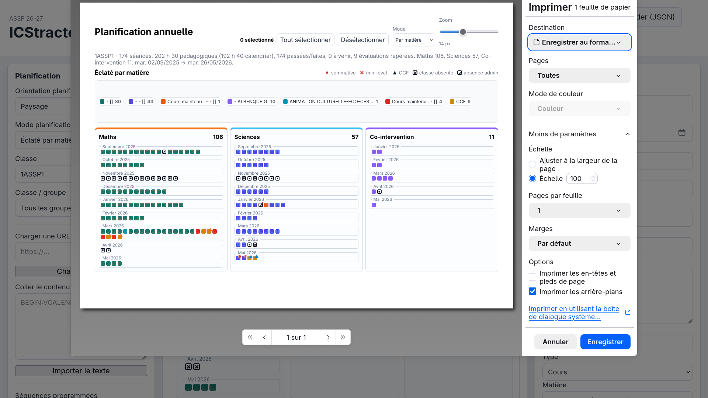
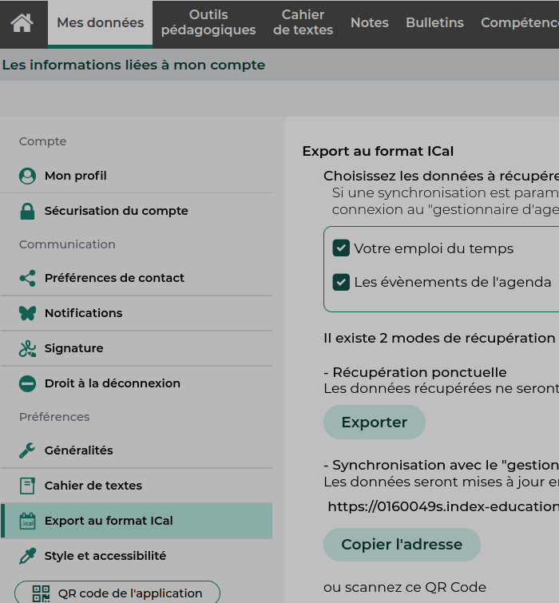

# 🗓️ ICStracteur — Planifiez vos cours depuis Pronote

**ICStracteur** est une application web locale qui transforme votre emploi du temps Pronote (exporté au format `.ics`) en un véritable outil de planification annuelle et de suivi. Conçu spécifiquement pour les enseignants, il vous permet de lier facilement vos séquences pédagogiques à votre calendrier, le tout avec une interface moderne et intuitive.

> [!IMPORTANT]
> **Respect de la vie privée (RGPD) :** L'application fonctionne entièrement en local dans votre navigateur. Vos données d'emploi du temps, vos annotations et vos séquences ne sont jamais envoyées sur un serveur externe.

---

## ✨ Aperçu

### Vue Planification Annuelle
Visualisez en un coup d'œil votre progression, les évaluations et vos séquences sur l'année.

### Export PDF et Impression
Générez facilement des documents de progression pour vos inspections ou votre organisation personnelle.

---

## 🚀 Démarrage Rapide

### 1. Exportez votre calendrier Pronote
Pour charger vos cours, vous devez récupérer votre fichier d'emploi du temps au format `.ics` (iCalendar) :
1. Connectez-vous à **Pronote**.
2. Cliquez sur le bouton d'export iCal (en haut à droite de l'emploi du temps).
3. Téléchargez le fichier sur votre ordinateur.

### 2. Lancez l'application
Aucune installation n'est requise :
1. Ouvrez le dossier `ICStracteur-main`.
2. Double-cliquez sur `index.html`. L'application s'ouvre dans votre navigateur (Chrome, Firefox, Safari...).
3. Utilisez le bouton en haut **Importer un ICS** pour charger votre fichier.

### 3. Planifiez et Organisez
- Filtrez par **Classe** et par **Groupe**.
- Utilisez la vue **Planification** pour créer votre catalogue de séquences.
- L'import automatique depuis vos dossiers locaux génère le catalogue instantanément.
- Exportez votre progression annuelle en **PDF** (avec choix du format A4/A3, mode Portrait/Paysage).

---

## 📖 En savoir plus
Pour une description détaillée de toutes les fonctionnalités (suivi des documents, gestion des CCF, import de dossiers de cours, etc.), consultez notre documentation :

👉 **[Consulter le Manuel Utilisateur détaillé](./MANUEL_UTILISATEUR.md)**

---

## 🛠️ Développement et Contributions
L'application est développée en HTML, Vanilla CSS et JavaScript pur (sans framework lourd) pour une réactivité maximale et une exécution hors-ligne garantie.
